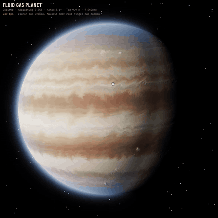

# Fluid Gas Planet

**Echtzeit-Gasplaneten im Browser, berechnet statt gemalt.** Strömungssimulation auf einer
Kugel in WebGPU, ohne eine einzige Bilddatei für die Planetenoberfläche. Jupiter ist der
Maßstab, weil er am besten vermessen ist; Saturn, Neptun, Uranus, ein heißer Jupiter und
Zufallsplaneten laufen mit derselben Technik.

<p align="center">
  
  <br><sub>Echtzeit-Aufnahme auf einer Desktop-GPU (~240 fps), von elias-nero-tron ·
  <a href="docs/media/jupiter-session.mp4">ganze 30-Sekunden-Sitzung mit Reglern</a></sub>
</p>

**▶ Sofort ausprobieren:** [Planeten-Simulator](https://raw.githack.com/elias-nero-tron/Fluid-Gas-Planet/main/demo/index.html) ·
[Sahne im Kaffee](https://raw.githack.com/elias-nero-tron/Fluid-Gas-Planet/main/demo/coffee.html)
(Browser mit WebGPU nötig) · oder [`demo/index.html`](demo/index.html) herunterladen und lokal öffnen.

Idee und Projektleitung: **elias-nero-tron** · Lizenz: Apache 2.0 · Zitieren: [CITATION.cff](CITATION.cff) · [English](README.md)

| Jupiter | Saturn | Neptun |
|---|---|---|
|  |  |  |

---

## Status

| Version | Inhalt | Geprüft |
|---|---|---|
| **v0.1.0** (Branch `release/v0.1.0`) | Prototyp: Stable Fluids und Partikel, 5 Planeten, Regler mit Erklärtexten | ✅ auf echter Hardware (iGPU, ~60 fps nach Augenmaß). Urteil: aus der Ferne überzeugend, aus der Nähe zu grob |
| **v0.2.3** (Vorabversion, `main`; v0.1-Look, Ladebild, 60-fps-Automatik, Zufallsplaneten, Speichern/Rückgängig) | Kanten-Fix, freie Stürme, Einschwingen, Gaseous-Giganticus-Rezept, Kaffee-Demo | 🔶 nur im Software-Renderer, Bestätigung auf Hardware offen |

Was funktioniert, was nicht, und die gemessenen Befunde stehen in [docs/STATUS.md](docs/de/STATUS.md).

## Ausprobieren

```bash
npm install
npm run dev        # http://localhost:5173 (Planet), /demos/coffee.html (Sahne im Kaffee)
npm run build      # dist/index.html: eine einzige Datei, überall hostbar
```

Braucht WebGPU: Chrome/Edge ab 113, Safari ab 26, Firefox ab 141, Android-Chrome ab 121.
Nach dem Aktivieren von GitHub Pages (Einstellungen → Pages → Quelle: „GitHub Actions“) läuft der
Simulator öffentlich unter der Pages-Adresse dieses Repos, die Kaffee-Demo unter `/demos/coffee.html`.

## Was drin ist

- **Zwei Verfahren, frei kombinierbar.** Strömung: *Stable Fluids* (Druck, Coriolis, Jets,
  Wirbel) oder *Curl-Noise* nach dem Rezept von Gaseous Giganticus. Darstellung: *Farbstoff*
  (Farbtextur wird mitgeführt) oder *Partikel* (bis 4 Mio.).
- **Planeten sind Zahlen:** gemessene Windprofile, Farbbänder, Stürme, Abplattung, Achsneigung,
  Ringe. Dazu „Farben aus Bild“: Bandfarben aus einem Foto messen.
- **Zufallsplaneten und Speichern:** 🎲 würfelt einen echten Zufallsplaneten aus fünf Familien (jupiter-,
  saturnartig, Eisriese, heißer Jupiter, exotisch). Rückgängig/Wiederholen (Strg+Z/Y), Doppelklick auf einen
  Reglernamen setzt ihn zurück, benannte Speicherplätze und ein Planeten-Code zum Weitergeben.
- **Rund 40 Regler**, jeder erklärt, was er physikalisch verändert. Debug-Ansichten für Wind,
  Wirbelstärke und Druck, Kartenansicht der ganzen Kugel.
- **Darstellung:** Ellipsoid, Minnaert-Randverdunkelung, Relief, Dunstsaum, Ringe mit Schatten.
- **Kaffee-Demo** ([demos/coffee.html](demos/coffee.html)): Sahne gießen und umrühren. Prüfstein
  für drei Bausteine, die dem Planeten noch fehlen (Quellen, Hindernisse, scharfer Transport).

## Technik und Haltung

- **WebGPU + WGSL, TypeScript, keine Engine.** WGSL läuft auch nativ (wgpu, Dawn), die
  Simulation ist nicht an einen Browser oder ein Framework gebunden.
- **Würfelkugel statt Weltkarte:** keine Pol-Singularität. Wind als 3D-Tangentialvektor,
  Ableitungen mit echter Gittermetrik.
- **Physik vor Effekt:** Jedes Verhalten soll aus einer benennbaren Gleichung kommen. Wo
  getrickst wird (Relief aus Helligkeit, Rückstellung der Bänder), steht es dabei.
- **Messen statt raten:** Fehler werden mit Testfeldern und Auslese der GPU-Werte belegt
  (Testmodus `#offscreen`).
- **Offen und nachvollziehbar:** Jede Formel mit Fundstelle im Code in
  [docs/MATHEMATIK.md](docs/de/MATHEMATIK.md), jede Quelle in [CREDITS.md](docs/de/CREDITS.md).
  Kein fremder Code, nur veröffentlichte Verfahren.

## Weiterarbeiten

Einstieg für Menschen und für neue KI-Sitzungen, in dieser Reihenfolge:

1. [docs/STATUS.md](docs/de/STATUS.md): geprüft vs. unverifiziert, Befunde der Fehlersuche
2. [docs/ROADMAP.md](docs/de/ROADMAP.md): Stärken, Schwachpunkte, Baustellen nach Wirkung sortiert
3. [docs/MATHEMATIK.md](docs/de/MATHEMATIK.md): Formeln ↔ Code
4. [CONTRIBUTING.md](docs/de/CONTRIBUTING.md): Regeln fürs Mitmachen

Nächste Schritte nach Wirkung: **advektierte Texturkoordinaten** (Baustelle 1a: Feinstruktur
getrennt von der Simulation, Schlieren in beliebiger Auflösung), **Atmosphärenstreuung** (1b) und
**Flachwasser-Gleichungen** (1c: richtige Physik für kompakte Jupiter-Wirbel).

## Aufbau

```
src/
  main.ts              WebGPU-Start, Felder, Ablauf pro Bild, Kamera, Regler
  presets.ts           Planeten als Zahlen; Farben aus Bild; Zufallsplanet
  ui.ts                Reglerpanel mit Erklärtexten
  math.ts              Matrizen
  shaders/common.wgsl  Würfelkugel, nahtloses Abtasten, Rauschen, Tabellen, Stürme
  shaders/fluid.wgsl   Stable Fluids auf der Kugel (Metrik-Ableitungen, Breitenkreis-Mittel)
  shaders/tracers.wgsl Farbstoff, Curl-Noise-Feld, Wirbel, Partikel
  shaders/render.wgsl  Ellipsoid, Licht, Relief, Dunstsaum, Ringe, Debug-Ansichten
demos/coffee.html      Sahne im Kaffee (eigenständig, ohne Build)
docs/                  Englisch; docs/de/: deutsche Fassungen, Recherche, ursprünglicher Plan
```

## Lizenz und Nennung

[Apache License 2.0](LICENSE). Nutzen, verändern, weitergeben, auch kommerziell, sind erlaubt und
erwünscht. Wer das Projekt oder ein abgeleitetes Werk weitergibt, liefert die [NOTICE](NOTICE)-Datei
mit und nennt damit den Urheber. Zitieren nach [CITATION.cff](CITATION.cff). Danksagungen an alle,
auf deren Arbeit das Projekt aufbaut: [CREDITS.md](docs/de/CREDITS.md).
