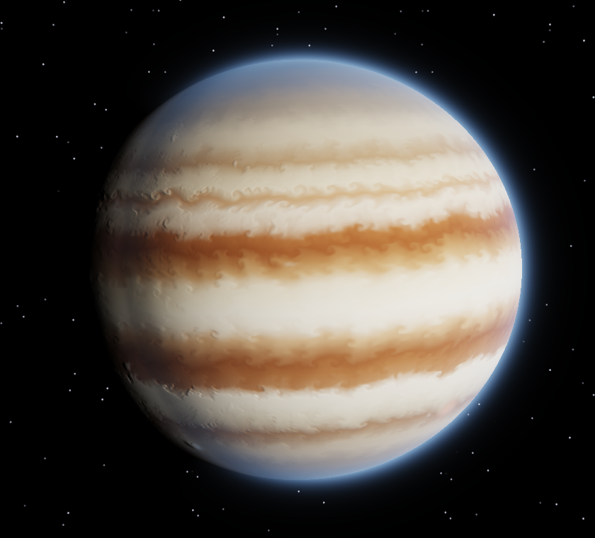
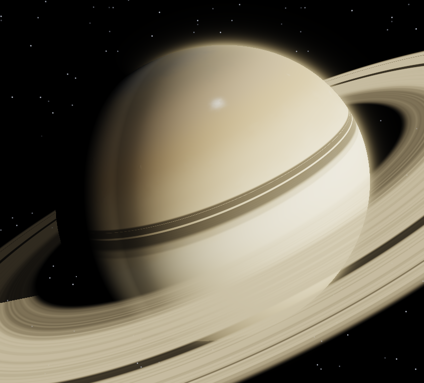
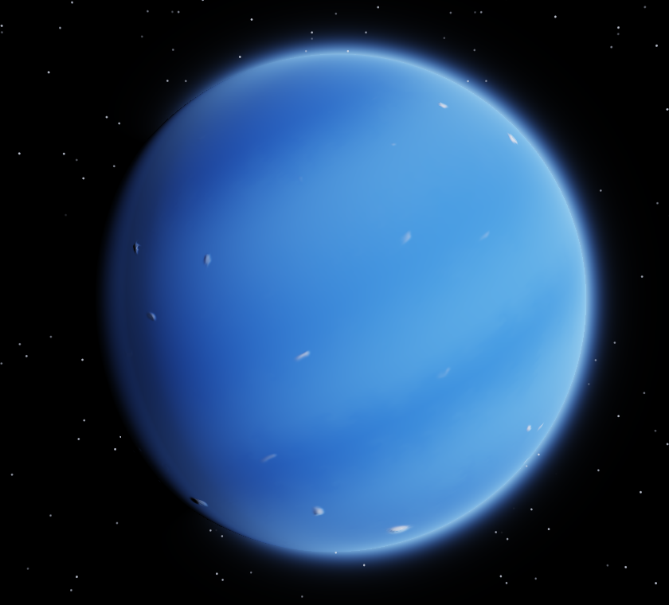
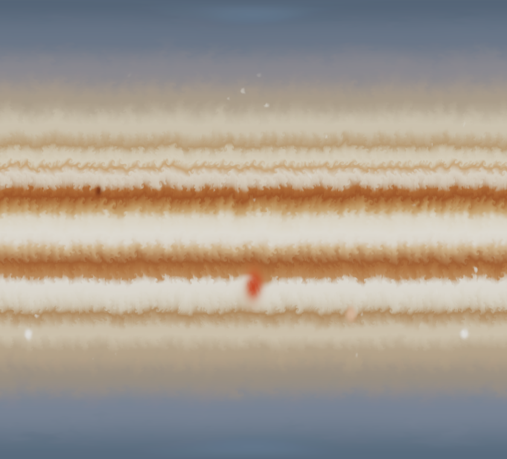

# Fluid Gas Planet

**Real-time gas giants in the browser — computed, not painted.** A fluid simulation on a sphere,
running entirely on the GPU with WebGPU. No image textures: every cloud band, jet and storm comes
from equations and numbers. Jupiter is the benchmark because it is the best-measured gas giant;
Saturn, Neptune, Uranus, a hot Jupiter and random planets run on the same engine.

**▶ Try it now:** [Planet simulator](https://raw.githack.com/elias-nero-tron/Fluid-Gas-Planet/main/demo/index.html) ·
[Cream in Coffee demo](https://raw.githack.com/elias-nero-tron/Fluid-Gas-Planet/main/demo/coffee.html)
(needs a WebGPU browser: Chrome/Edge 113+, Safari 26+, Firefox 141+, Android Chrome 121+).
Or download [`demo/index.html`](demo/index.html) and open it locally, no install needed.

Created by **elias-nero-tron** · Apache License 2.0 · [How to cite](CITATION.cff) · [Deutsch](README.de.md)

| Jupiter | Saturn | Neptune |
|---|---|---|
|  |  |  |


*All images are renders of this simulator, not photos. Made in a software renderer shortly after start; on a real GPU the flow keeps developing more swirls and storms.*

---

## Status

| Version | What | Verified |
|---|---|---|
| **v0.1.0** (branch `release/v0.1.0`) | Prototype: Stable Fluids and particles, 5 planets, controls with explanations | ✅ on real hardware (integrated GPU, ~60 fps). Verdict: convincing from afar, too coarse up close |
| **v0.2.3** (pre-release, `main`) | v0.1 look as defaults, loading screen (starts mid-flow), auto quality for 60 fps, random planets, save/undo, optional free-evolving storms, Gaseous Giganticus recipe, coffee demo, English UI | 🔶 software renderer only; hardware confirmation pending |

Details, measured findings and open questions: [docs/STATUS.md](docs/STATUS.md).

## What it does

- **Two methods, freely combined.** Flow: *Stable Fluids* (pressure, Coriolis, jets, vortices) or
  *curl noise* following the Gaseous Giganticus recipe. Look: *dye* (the colour texture is carried
  by the wind) or *particles* (up to 4 million).
- **Planets are numbers:** measured wind profiles, colour bands, storms, oblateness, axial tilt,
  rings. Plus “Colours from image”: measure band colours from any photo.
- **Random planets and saving:** 🎲 rolls a truly random planet from five families (Jovian, Saturnian,
  ice giant, hot Jupiter, exotic). Undo/redo (Ctrl+Z/Y), double-click a control name to reset it, named
  save slots and a planet code to share exactly the same planet.
- **About 40 controls, each explaining what it changes physically.** Debug views for wind,
  vorticity and pressure, plus a map view of the whole sphere. English and German UI.
- **Rendering:** oblate ellipsoid, Minnaert limb darkening, cloud relief, haze rim, rings with shadows.
- **Cream in Coffee** ([demos/coffee.html](demos/coffee.html)): pour and stir. A test bench for three
  building blocks the planet still lacks: sources, moving obstacles and sharp transport.

## Technology and approach

- **WebGPU + WGSL, TypeScript, no engine.** WGSL also runs natively (wgpu, Dawn), so the
  simulation is not tied to a browser or framework.
- **Cube-sphere instead of a lat/long map:** no pole singularity. Wind stored as 3D tangent vectors,
  derivatives use the real grid metric, seam-exact sampling across cube edges.
- **Physics before effects:** every behaviour should come from a nameable equation. Where it cheats
  (relief from brightness, band restoring), the docs say so.
- **Measure, don't guess:** bugs are proven with test fields and GPU read-back (`#offscreen` mode).
- **Open and traceable:** every formula with its location in the code in [docs/MATH.md](docs/MATH.md),
  every source in [CREDITS.md](CREDITS.md). No third-party code copied, only published methods.

## Continue the work

Entry point for people and for new AI sessions, in this order:

1. [docs/STATUS.md](docs/STATUS.md): verified vs. unverified, measured findings
2. [docs/ROADMAP.md](docs/ROADMAP.md): strengths, weaknesses, work items ranked by impact
3. [docs/MATH.md](docs/MATH.md): formulas ↔ code
4. [CONTRIBUTING.md](CONTRIBUTING.md)

Next steps by impact: **advected texture coordinates** (item 1a: fine detail decoupled from the
simulation, streaks at any resolution), **atmospheric scattering** (1b) and **shallow-water
equations** (1c: the right physics for compact Jupiter vortices).

## Build

```bash
npm install
npm run dev        # http://localhost:5173 (planet), /demos/coffee.html (coffee)
npm run build      # dist/index.html and demo/ — single self-contained files
```

GitHub Pages: enable once under Settings → Pages → Source “GitHub Actions”; the workflow then
publishes `demo/` on every push to `main`.

## Layout

```
src/
  main.ts              WebGPU setup, fields, per-frame pipeline, camera, controls
  presets.ts           planets as numbers; colours from image; random planet
  i18n.ts              English/German
  ui.ts                control panel with explanations
  shaders/common.wgsl  cube-sphere, seam-exact sampling, noise, tables, storms
  shaders/fluid.wgsl   Stable Fluids on the sphere (metric derivatives, zonal mean)
  shaders/tracers.wgsl dye, curl noise field, vortices, particles
  shaders/render.wgsl  ellipsoid, lighting, relief, haze, rings, debug views
demos/coffee.html      cream in coffee (standalone, no build)
demo/                  ready-to-run builds for the click-to-try links
docs/                  status, roadmap, math (English); docs/de/: German originals, research, first plan
```

## License and attribution

[Apache License 2.0](LICENSE). Use, modify and redistribute, including commercially — building on
this is explicitly welcome. Anyone redistributing the project or a derivative must include the
[NOTICE](NOTICE) file, which credits the author. Please cite via [CITATION.cff](CITATION.cff).
Thanks to everyone whose work this builds on: [CREDITS.md](CREDITS.md).
